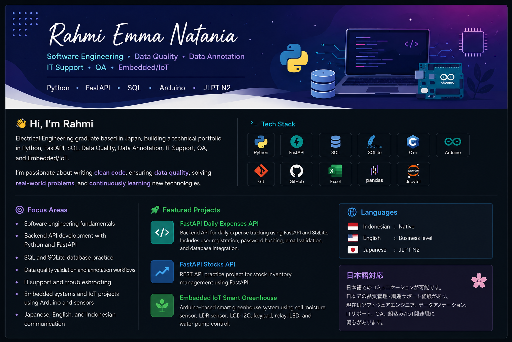

  

<h1 align="center">Hi, I'm Natania 👋</h1>

  Electrical Engineering graduate based in Japan  
  Python · FastAPI · SQL · Data Quality · Embedded/IoT · JLPT N2

  
  
  
  
  
  

---

## About Me

I am an Electrical Engineering graduate based in Japan, currently building a technical portfolio in Python, FastAPI, SQL, Data Quality, and Embedded/IoT.

I am interested in Software Engineering, Data Annotation, IT Support, QA, and Embedded/IoT-related roles.

---

## Focus Areas

- Software engineering fundamentals
- Backend API development with Python and FastAPI
- SQL and SQLite database practice
- Data quality validation and QA mindset
- Embedded systems and IoT projects using Arduino and sensors
- Japanese, English, and Indonesian communication

---

## Featured Projects

### FastAPI Daily Expenses API
Backend API for daily expense tracking using FastAPI and SQLite.  
Includes user registration, password hashing, email validation, and database integration.

### FastAPI Stocks API
REST API practice project for stock inventory management using FastAPI.

### Embedded IoT Smart Greenhouse
Arduino-based smart greenhouse system using soil moisture sensor, LDR sensor, LCD I2C, keypad, relay, LED, and water pump control.

---

## Tech Stack

Python · FastAPI · SQL · SQLite · C++ / Arduino · Git · GitHub · Excel

---

## Languages

- Indonesian: Native
- English: Business level
- Japanese: JLPT N2

---

## 日本語対応

日本語でのコミュニケーションが可能です。  
日本での品質管理・調達サポート経験があり、現在はソフトウェアエンジニア、データアノテーション、ITサポート、QA、組込み/IoT関連職に関心があります。
